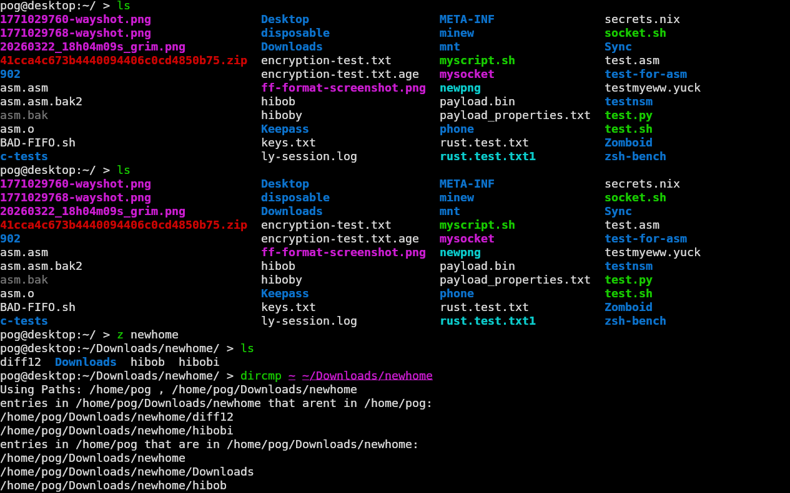

# dircmp
dircmp compares the file names and types of entries in a directory recursivley.
Diffrent files and similar files are output.


## Logic
the core logic of dircmp uses hasbrown::hashmap and walkdir
for the cli pico_args is the argument processor

the cmp_dir 's function that actually does the comparing is only about 30 lines of code

1. relative paths of files in dir1 are keys to hashmap, DirEntry's are values
2. DirEntry's of Files in dir2 are written to vector
3. Vector is iterated
4. for each entry, realtive path is calculated, if map contains relative path of the entry, entry is same else it is diffrent

This is really inefficent for small comparisions but for large comparissions its probably faster than reapeted ```
std::path::Path::exists() ```

Right now my implememntation is pretty flawed it recursivley maps every file in both directories using walkdir regargdless of if the parent directory it is traverssing even exists in source dir

## Use 

```
dircmp

USAGE:
  dircmp [DIR1] [DIR2] [FLAGS] 

FLAGS:
  -h, --help            Prints help information
  -v, --version         Prints version
```



## Installation

### Cargo+Git
```bash
git clone https://github.com/Pogwat/dircmp
cd dircmp
cargo build --release
cd target/release
./dircmp
```

### Binaries
Download the binary [In releases](https://github.com/Pogwat/dircmp/releases)

### Nix

Use this as the file contents of your overlays.nix and then use the pacakges
```nix
{ rustPlatform, lib, fetchFromGitHub }:
rustPlatform.buildRustPackage rec {
  pname = "dircmp";
  version = "0.1";
  src =  fetchFromGitHub {
    owner = "Pogwat";
    repo = "dircmp";
    rev = "v${version}";
    hash = "sha256-tCDpDeADQCQrl4cOYibz3xHw8LolSfeFY7p0mxQddgs=";
  };
  cargoLock = {
    lockFile = "${src}/Cargo.lock";
  };

  meta = {
    description = "Compare file names of 2 directories, return diffrent files and same files ";
    homepage = "https://github.com/Pogwat/dircmp";
    license = lib.licenses.mit;
    platforms = lib.platforms.linux;
    maintainers = with lib.maintainers; [];
    mainProgram = "dircmp";
  };
}
```

